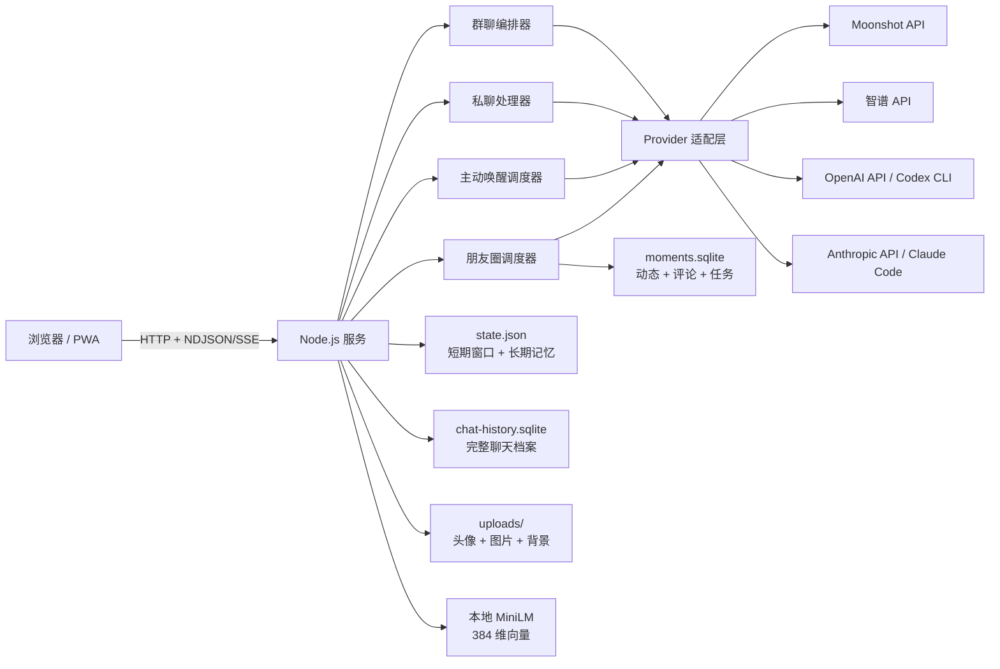

# LIVING ROOM

LIVING ROOM 是一个可自托管的多模型私人社交空间。它把群聊、各成员私聊、长期记忆、主动消息和朋友圈放在同一个网页里，让多个模型像群成员一样并发阅读、自由接话、互相引用，也允许选择不回复。

项目面向个人使用，采用 Node.js 原生 HTTP 服务、原生 HTML/CSS/JavaScript 和本地持久化；不依赖前端框架或外部数据库。默认只监听本机，API Key、聊天记录、原始记忆、上传图片和向量均保留在运行机器上。

> 仓库中的 `Okra`、`Gen`、`Kimi`、`Shin`、`K` 是示例成员名和示例人格。复刻时可以修改对应 persona 与前端成员配置。运行数据绝不应提交到 Git。

## 功能概览

| 模块 | 能力 |
| --- | --- |
| 多 AI 群聊 | 首轮并发处理；谁先完成谁先显示；成员可跳过、@ 其他成员、引用具体消息并继续有限回复链 |
| 独立私聊 | Gen、Kimi、Shin 拥有独立聊天页、草稿、背景、搜索和未读状态 |
| 连续上下文 | 每个成员能看到自己的私聊与群聊近期上下文，但不能看到其他成员私聊 |
| 长期记忆 | 模型自主创建/更新，用户可人工编辑；关键词与本地向量混合检索；轻量 rerank、去重和提示词预算 |
| 长期聊天档案 | 前端窗口保持轻量，完整消息另存 SQLite，可按当前聊天搜索并加载更早记录 |
| 主动推送 | 成员按各自时钟醒来，自行决定跳过、发私聊或发群聊；页面关闭也可继续 |
| 朋友圈 | 用户与模型可发动态、图片、点赞、评论、回复指定评论；模型每天有随机候选时段并可选择不发 |
| 多模态 | 用户上传图片；Kimi/GLM 可接收图片，GLM 自动切换视觉模型；上传图片压缩并存于服务器 |
| 工具调用 | Kimi 支持 Moonshot Formula 工具循环；Shin 对明确的实时查询调用 GLM Web Search |
| PWA 式手机体验 | 聊天列表、未读红点、长按复制/引用/本地删除、资料卡、自定义头像与背景、大图预览 |
| Gen 干活模式 | 可让本机 Codex CLI 在服务器白名单工作区中修改文件；聊天模式保持只读 |

## 系统架构



主要边界：

- 浏览器只负责界面、上传和同步，不直接持有模型 API Key。
- 所有模型调用、工具执行、回复链限制、记忆读写和权限隔离都在服务端完成。
- 页面离开、手机切后台或网络短暂中断不会取消已被服务器接受的生成；重新打开后通过状态接口补齐结果。
- 前端可以隐藏单条消息，但这不会删除服务端档案或改变模型上下文。

## 快速开始

### 1. 环境要求

- Node.js 22 或更新版本。
- 至少配置一个模型入口。
- 如果使用 Gen：安装并登录官方 Codex CLI。
- 如果使用 Claude Code：安装并登录 Claude Code CLI。

### 2. 安装

```powershell
git clone https://github.com/dengyachen643-afk/LIVING-ROOM.git
cd LIVING-ROOM
npm ci
Copy-Item .env.example .env
```

macOS / Linux：

```bash
git clone https://github.com/dengyachen643-afk/LIVING-ROOM.git
cd LIVING-ROOM
npm ci
cp .env.example .env
```

编辑 `.env`，至少启用一个 Provider。例如只接入 Kimi：

```dotenv
HOST=127.0.0.1
PORT=8787
ROUNDTABLE_PUBLIC_ACCESS=false
ROUNDTABLE_ACCESS_TOKEN=请生成一个足够长的随机口令

MOONSHOT_API_KEY=你的_Moonshot_Key
KIMI_MODEL=kimi-k2.5
KIMI_PRIVATE_MODEL=kimi-k2.5
```

启动：

```powershell
npm start
```

打开 <http://127.0.0.1:8787>。

开发时可以使用自动重启：

```powershell
npm run dev
```

## 模型接入

所有配置项都可在 [.env.example](.env.example) 查看。没有 Key 的成员会显示为未连接，不影响其他成员运行。

### Kimi / Moonshot

```dotenv
MOONSHOT_API_KEY=
KIMI_BASE_URL=https://api.moonshot.cn/v1
KIMI_MODEL=kimi-k2.5
KIMI_PRIVATE_MODEL=kimi-k2.5
KIMI_TOOLS_ENABLED=true
KIMI_MEMORY_MODEL=moonshot-v1-8k
KIMI_AUTO_MEMORY=true
```

也可以在 Kimi 私聊页首次输入 Key。服务端把它写入 `KIMI_KEY_FILE`，以后手机和电脑共用；配置接口只返回“是否已配置”，不会返回 Key 原文。

当前策略：

- Kimi 私聊和群聊关闭 K2.5 思考，以降低费用与等待时间。
- 朋友圈决策保留思考，因为它需要判断发不发、发什么以及是否配图。
- `reasoning_content` 与正文分开处理，历史思考不会在下一轮重复发送。
- 当前 Kimi 对话请求不强行发送 `temperature` / `top_p`；这两个配置主要用于兼容的记忆整理模型，避免对不接受该组合的推理模型造成空回复。
- 开启工具后，服务端完成标准循环：模型返回 `tool_calls` → 服务端执行 Formula → 写入 `tool` 消息 → 再请求最终回复。不能把模型正文中的“（搜索……）”当成真实搜索。

### Shin / GLM

```dotenv
GLM_API_KEY=
GLM_BASE_URL=https://open.bigmodel.cn/api/paas/v4
GLM_MODEL=glm-5.1
GLM_VISION_MODEL=glm-5v-turbo
GLM_PRIVATE_ENABLED=true
GLM_AUTO_MEMORY=true
GLM_MEMORY_MODEL=glm-5.1
```

当前策略：

- 普通文字使用 `glm-5.1`，图片消息自动切换到 `glm-5v-turbo`。
- 聊天默认开启 GLM thinking，并单独显示思考过程。
- 如果模型只返回 reasoning、正文为空，服务端会自动用关闭 thinking 的请求重试，避免前端出现“空回复”。
- 联网搜索不是看到“搜索”二字就触发，而是由明确查询意图判断。例如“你终于能搜索了”不会联网，“帮我查今天的天气”才会调用 Web Search。
- 搜索结果先作为受控上下文交回模型，再由模型组织正文；朋友圈生成默认禁用聊天搜索，避免把原始搜索结果直接当成动态发布。
- GLM 的 thinking 与 OpenAI 风格 `reasoning_effort` 不是同一个接口概念，不应同时假设二者都受支持。

### Gen / Codex CLI

Gen 可以复用本机已有的 ChatGPT/Codex 登录，不要求 OpenAI API Key：

```dotenv
GEN_PRIVATE_ENABLED=true
GEN_PRIVATE_COMMAND=codex
GEN_PRIVATE_MODEL=gpt-5.6-sol
GEN_REASONING_EFFORT=medium
GEN_TIMEOUT_SECONDS=600
```

聊天模式使用临时会话和只读沙箱。若要开放“干活”：

```dotenv
GEN_WORK_ENABLED=true
GEN_PROJECT_DIR=D:\path\to\LIVING-ROOM
GEN_WORKSPACE_DIR=D:\path\to\another-allowed-workspace
GEN_WORK_REASONING_EFFORT=high
GEN_WINDOWS_SANDBOX=unelevated
```

浏览器只提交工作区 ID，不能提交任意磁盘路径。服务端把 ID 映射到上述白名单目录，并以 `workspace-write`、`approval_policy=never` 运行。不要把数据目录、家目录或系统目录加入白名单。

### OpenAI API

```dotenv
OPENAI_API_KEY=
OPENAI_BASE_URL=https://api.openai.com/v1
OPENAI_MODEL=你的模型名
OPENAI_REASONING_EFFORT=medium
```

### Claude API / Claude Code

```dotenv
ANTHROPIC_API_KEY=
ANTHROPIC_BASE_URL=https://api.anthropic.com
ANTHROPIC_MODEL=你的模型名

CLAUDE_CODE_ENABLED=false
CLAUDE_CODE_COMMAND=claude
CLAUDE_CODE_MODEL=你的模型名
```

Claude Code 群聊适配器使用无持久会话、无工具的单轮模式，群历史与记忆由服务端显式传入。

## 群聊编排机制

一次用户发言的处理顺序：

1. 服务端先保存用户消息并立即返回 accepted/read 状态。
2. 所有选中的在线成员同时收到同一条新消息并开始生成。
3. 谁先完成，谁的回复先保存并显示；不是固定先 Gen 后 Kimi。
4. 成员可以输出内部跳过标记，服务端不会把标记显示成消息。
5. 首轮结束后，成员可以阅读本轮其他人的新回复，决定是否继续接话、引用或 @ 某人。
6. 用户可以在 AI 接话期间继续输入；新消息会成为新的群聊上下文，而不是必须等待整条链结束。

`@` 是重点邀请，不是排他路由。例如：

```text
Okra：@Kimi 这部电影你怎么看？
```

Kimi 会被重点邀请，但其他在线成员仍可判断自己是否值得接话。AI 也可以写 `@Gen` 把问题继续交给 Gen。

防止无限聊天的服务端硬限制：

- 一条链最多显示 20 条成员消息。
- 每位成员在同一条链最多发言 5 次。
- 重复触发、重复正文与相同引用会被去重。
- 跳过不消耗可见消息额度。
- Gen 未被点名的环境式追答最多 1 次，避免 Codex 消耗失控。
- 单轮调用有超时和 AbortController；用户可以停止当前链。

引用使用真实消息 ID。模型若要引用，输出内部指令 `[[QUOTE:消息ID]]`，服务端校验目标存在、不是自己发的消息，再转换为可见引用；伪造 ID 会被丢弃。

## 上下文与时间格式

聊天窗口在 UI 上分开，模型上下文按身份连续：

| 成员 | 可见上下文 |
| --- | --- |
| Gen | Gen 私聊 + 群聊；不能看到 Kimi/Shin 私聊 |
| Kimi | Kimi 私聊 + 群聊；不能看到 Gen/Shin 私聊 |
| Shin | Shin 私聊 + 群聊；不能看到 Gen/Kimi 私聊 |
| K | 群聊 |

系统提示词始终给出当前上海时间和英文星期，例如：

```text
当前时间：2026-08-03 Mon 09:20（Asia/Shanghai）
```

历史记录每天只声明一次日期，每条消息仅保留分钟和场景：

```text
[日期：2026-08-03 Mon]
[09:18 私聊] Okra：今晚提醒我看电影。
[09:20 群聊] Kimi：这部我看过。
```

这样既保留“今天、昨天、星期几”的判断依据，也避免为每条历史重复日期、秒数和 UTC 描述。

模型不会读取整个聊天数据库：

- 群聊保留最近 60 条可见上下文。
- 私聊使用各自受控的近期窗口。
- Gen 遇到“刚才那个”“之前说过的”一类指代时，会从更早记录中按语义补取少量相关片段。
- 完整历史只用于网页搜索和人工回看，不会无限塞进模型提示词。

## 长期记忆机制

### 记忆存在哪里

长期记忆保存在 `ROUNDTABLE_STATE_FILE`，默认是：

```text
.roundtable/state.json
```

每条记忆包含稳定 ID、正文、命名空间、标签、重要度、来源、时间、可选元数据以及本地 embedding。默认最多保留 1000 条。

命名空间决定谁可以读取：

| namespace | 所属成员 |
| --- | --- |
| `g` / 兼容旧 `gpt` | Gen |
| `kimi` | Kimi |
| `glm` | Shin |
| `k` | K |
| `shared` | 可被所有相关成员检索的公共事实 |

### 如何写入

记忆动作分三种：`create`、`update`、`delete`。

- Gen 在正常回复的同一次结构化生成中给出记忆动作，服务端校验后执行。
- Kimi 和 Shin 使用独立记忆整理调用。普通聊天按批次整理，减少“每条回复再付一次模型费”；明确说“记住、修改、忘记”时优先处理。
- 群聊中的成员只维护自己的 namespace；公共事实可进入 `shared`。
- 新建前会检索相近记忆。同一事实优先更新，而不是创建近义重复项。
- 删除必须有用户当前明确的忘记/删除意图，模型不能自行清除长期事实。
- 密码、API Key、验证码、支付资料和精确住址不应进入长期记忆。

示例：

```text
用户：以后给我推荐咖啡时，不要推荐特别甜的。
```

适合保存为稳定偏好：

```json
{
  "namespace": "kimi",
  "text": "用户偏好低甜度咖啡，推荐饮品时避免特别甜的选项。",
  "labels": ["preference", "food"],
  "importance": 4
}
```

“我今天有点困”通常不写入长期记忆，因为它是短期状态。

### 如何向量化

默认本地模型：

```text
Xenova/paraphrase-multilingual-MiniLM-L12-v2
```

它通过 `@huggingface/transformers` 在本机生成 384 维归一化向量，模型缓存位于 `.roundtable/models`。向量不会交给 Kimi、GLM 或浏览器，也不产生额外 embedding API 费用。

首次启用需要下载模型。旧记忆可批量重建：

```powershell
npm run reindex
```

### 如何检索与使用

每次回复前执行轻量 RAG：

1. 用本轮消息生成查询向量。
2. 只在当前成员 namespace 与 `shared` 中取候选，默认每个 namespace 最多取约 20 条。
3. 存储层结合关键词分数、向量余弦相似度和重要度做第一轮排序。
4. 提示词层再按完整短语、关键词命中、重要度和新旧程度轻量 rerank。
5. 按 ID、规范化正文和高向量相似度去重。
6. 截断过长单条记忆，并限制最终条数和总字符数。

当前预算：

| 场景 | 最多条数 | 记忆字符预算 |
| --- | ---: | ---: |
| 私聊 / 群聊 | 6 | 1200 |
| 主动推送 | 4 | 800 |
| 朋友圈 | 5 | 900 |

最终只有这些相关条目进入 system prompt。模型可以自然使用，但不能声称记得未被召回或未在当前上下文中的事实；用户本轮明确修正永远优先。

当前版本没有额外建立“会自然过期的短期记忆库”或“公共重要事件图谱”。临时状态继续依赖近期聊天，避免为了理论完整度增加额外调用、存储和 token 成本。

### 人工记忆编辑与 Custom GPT

- `/g-memory` 提供 Gen 记忆的搜索、新增、修改、删除和导出。
- `GPT_MEMORY_TOKEN` 只授权 `g` / `gpt` 记忆接口，不授权聊天、其他成员记忆或模型 Key。
- `/openapi.json` 可供私有 Custom GPT Action 使用。
- 详细步骤见 [docs/CHATGPT_MEMORY_SETUP.md](docs/CHATGPT_MEMORY_SETUP.md)。

## 聊天档案与搜索

两个层次分开存储：

- `state.json`：前端快速启动所需的最近 400 条消息、长期记忆、头像与部分 UI 状态。
- `chat-history.sqlite`：完整新消息档案，用于按聊天搜索和加载更早记录。

因此，前端显示窗口可以保持轻量，历史仍可长期翻阅。清空某个聊天会清理对应短期窗口和档案，但不会自动删除长期记忆。

## 主动推送

服务端为每个可用成员维护独立计时器。默认每小时醒来一次，成员错峰 5 分钟，并在配置的安静时段跳过。

每次醒来：

1. 检查服务是否繁忙；前台生成中不会重入。
2. 读取该成员允许看到的近期群聊/私聊。
3. 召回最多 4 条相关长期记忆。
4. 让模型严格选择 `SKIP`、`PRIVATE` 或 `GROUP`。
5. 将实际消息先写入服务器，再由网页轮询同步。
6. 失败后指数退避，避免持续烧 API。

配置示例：

```dotenv
PROACTIVE_ENABLED=true
PROACTIVE_INTERVAL_MINUTES=60
PROACTIVE_STAGGER_MINUTES=5
PROACTIVE_QUIET_START=00:00
PROACTIVE_QUIET_END=08:00
PROACTIVE_TIME_ZONE=Asia/Shanghai
PROACTIVE_MAX_BACKOFF_MINUTES=360
```

Kimi、Gen、Shin 可以选择自己的私聊或群聊；没有私聊入口的成员只能发群聊。模型没有合适内容时可以跳过。

## 朋友圈机制

朋友圈数据单独存入 `moments.sqlite`，不会持续放大聊天状态文件。

- 用户发布文字和最多 4 张图片；前端先乐观上墙，再后台上传，失败可重试。
- 图片在浏览器端转换/压缩，服务器再验证格式、尺寸并生成适合列表的版本。
- 每位可用成员每天默认获得 3 个覆盖全天的确定性随机候选时段；候选不等于必须发，成员可跳过。
- 朋友圈不是“延迟回复用户”的地方。提示词要求成员分享自己的生活感、兴趣、观察、新闻或想法；如果只是回应一句话，应去评论或聊天。
- 点赞、评论、回复关系长期保留。回复具体评论时显示“成员 A 回复成员 B”。
- 直接评论动态作者后，作者会在 10–120 分钟内获得回复任务；AI 之间也可以继续少量评论，但有链长、每日动作和单成员评论上限。
- 每位 AI 的个性签名最多 15 字，首次自行生成，约两周复查一次是否更新。
- 所有成员共用 GLM 图片生成通道；没有 GLM Key 时自动退化为纯文字动态。

配置：

```dotenv
MOMENTS_ENABLED=true
MOMENTS_DB_FILE=.roundtable/moments.sqlite
MOMENTS_SLOTS_PER_DAY=3
MOMENTS_TICK_SECONDS=30
MOMENTS_IMAGE_ENABLED=true
MOMENTS_IMAGE_MODEL=cogview-4-250304
```

## 图片、头像与背景

- 上传正文图片、头像、朋友圈封面和聊天背景都经过服务端类型校验。
- 用户可在资料卡中裁剪头像；头像和背景地址保存在共享 UI 状态中。
- 聊天图片点击后使用站内浮层预览，不会新开网页。
- 默认上传目录是 `.roundtable/uploads`，不会提交到 Git。

## 手机与远程访问

### Tailscale Funnel

Windows 已提供辅助脚本：

```powershell
powershell -ExecutionPolicy Bypass -File .\scripts\enable-remote-access.ps1 -Port 8787
```

脚本会从 `tailscale funnel status` 输出你自己的 HTTPS 地址。不要把真实地址写进仓库或公开文档。

手机只需访问 HTTPS 地址，不必让 Tailscale App 占用手机 VPN 槽位。电脑仍需开机、联网并运行本服务。

### 域名 / 反向代理

也可以用 Caddy、Nginx 或云隧道把 HTTPS 域名代理到 `127.0.0.1:8787`。生产部署至少应：

- 保持 `ROUNDTABLE_PUBLIC_ACCESS=false`。
- 设置高强度 `ROUNDTABLE_ACCESS_TOKEN`。
- 将 `PUBLIC_BASE_URL` 设置为最终 HTTPS 地址。
- 不直接暴露 `.roundtable`、模型缓存或上传目录的文件系统路径。
- 为 `/api/*` 保留流式响应能力并关闭代理缓冲。

`ROUNDTABLE_PUBLIC_ACCESS=true` 会让拿到网址的人直接访问聊天、记忆和图片，只适合完全受控的入口。

## 数据目录、备份与迁移

默认运行数据：

```text
.roundtable/
├─ state.json              # 最近消息、长期记忆、向量、UI 状态
├─ chat-history.sqlite     # 完整聊天档案
├─ moments.sqlite          # 朋友圈、评论、点赞、调度任务
├─ kimi-api-key.txt        # 可选的服务端 Kimi Key
├─ glm-api-key.txt         # 可选的服务端 GLM Key
├─ uploads/                # 用户图片、头像、背景
├─ models/                 # 本地 embedding 模型缓存
└─ gen-runtime/            # Gen 临时运行目录
```

这些路径全部被 `.gitignore` 排除。它们可能包含高度敏感数据。

备份前先停止服务，再复制整个数据目录。例如 Windows：

```powershell
Compress-Archive -Path .roundtable -DestinationPath living-room-private-backup.zip
```

备份包含聊天、记忆和可能的 API Key，必须按密码文件对待，不要上传 GitHub、网盘公开链接或发给模型。迁移到新机器时安装依赖、复制 `.env` 和数据目录，再启动服务即可；`models/` 可不迁移，首次使用时会重新下载。

也可以把数据移到代码仓库之外：

```dotenv
ROUNDTABLE_STATE_FILE=D:\LIVING-ROOM-DATA\state.json
CHAT_HISTORY_DB_FILE=D:\LIVING-ROOM-DATA\chat-history.sqlite
MOMENTS_DB_FILE=D:\LIVING-ROOM-DATA\moments.sqlite
UPLOAD_DIR=D:\LIVING-ROOM-DATA\uploads
MEMORY_MODEL_CACHE=D:\LIVING-ROOM-DATA\models
```

## 安全与隐私

提交代码前确认：

- `.env` 没有被跟踪。
- `.roundtable/`、SQLite、上传目录、模型缓存和备份没有被跟踪。
- README 中没有真实域名、Tailscale 主机名、本机用户名或绝对私人路径。
- 测试只使用明显的假 Key 和虚构消息。
- 没有提交记忆导出、聊天截图、原始头像、朋友圈图片或日志。

可运行：

```powershell
git status --short
git ls-files | Select-String -Pattern 'state.json|sqlite|uploads|\.env$|MEMORY'
```

注意：如果密钥曾进入 Git 历史，仅在新提交中删除不够；应立即轮换密钥，并使用专门的历史清理工具处理旧提交。

## API 概览

| 路径 | 用途 |
| --- | --- |
| `GET /api/config` | 返回脱敏配置和 Provider 可用状态 |
| `GET /api/state` | 最近消息、记忆与 UI 状态 |
| `GET /api/sync` | 增量同步聊天与主动消息 |
| `GET /api/history` | 搜索/加载长期聊天档案 |
| `POST /api/chat` | 群聊流式入口 |
| `POST /api/gen/chat` | Gen 私聊/干活入口 |
| `POST /api/kimi/chat` | Kimi 私聊流式入口 |
| `POST /api/glm/chat` | Shin 私聊流式入口 |
| `GET/POST/PATCH/DELETE /api/memories` | 记忆 CRUD 与混合搜索 |
| `GET/POST /api/moments` | 朋友圈列表与发布 |
| `POST /api/moments/:id/comments` | 评论或回复评论 |
| `PUT /api/moments/:id/like` | 点赞状态 |
| `GET /openapi.json` | 受限的 Gen 记忆 Action Schema |
| `GET /api/health` | 健康检查 |

私聊和群聊生成接口使用 NDJSON/SSE 风格增量事件；前端不应仅依赖当前连接判断任务是否完成，应同时通过 status/sync 接口恢复。

## 项目结构

```text
public/
  index.html, app.js, styles.css   聊天列表、群聊与私聊 UI
  moments.*                       朋友圈 UI
  member-profile.js, profile.css  成员资料卡、头像与签名
  g-memory.*                      Gen 记忆编辑器

src/
  server.js                       HTTP 路由、鉴权、运行状态与流程整合
  groupchat.js                    并发首轮、接话队列、引用与硬限制
  providers.js                    OpenAI/Kimi/GLM/Claude/Codex 适配器
  *-private.js                    各成员私聊协议与提示词
  *-memory.js                     记忆整理动作生成与校验
  memory-retrieval.js             RAG 候选、rerank、去重与预算
  embeddings.js                   本地多语言 embedding
  conversation-recall.js          更早聊天的按需语义召回
  store.js                        轻量状态与长期记忆
  message-archive.js              SQLite 完整聊天档案
  proactive.js                    主动推送调度器
  moments-service.js              朋友圈决策、评论与定时任务
  moments-store.js                朋友圈 SQLite 存储
  uploads.js                      图片校验、缩放和持久化
  prompt-time.js                  上海时间、英文星期与紧凑时间线
  quote-context.js                引用标准化与提示词格式

scripts/
  enable-remote-access.ps1        Tailscale Funnel 辅助脚本
  reindex-memories.js             重建记忆向量
  import-g-memory.js              导入 Gen 记忆文件

test/                             单元与端到端 HTTP 测试
docs/                             Custom GPT 记忆接入说明
```

## 给 Codex / Claude Code 的复刻顺序

如果让另一个代码代理从头理解或复刻，推荐按以下顺序阅读：

1. `src/store.js` 与 `src/message-archive.js`：先理解短期窗口、长期档案和记忆数据边界。
2. `src/providers.js`：确认每个厂商的请求格式、thinking、图片和错误处理差异。
3. `src/groupchat.js`：理解并发首轮、跳过、引用、@ 路由和链路硬限制。
4. `src/memory-retrieval.js`、`src/*-memory.js`：实现写入、向量化、检索、rerank 和权限隔离。
5. `src/server.js`：把私聊、群聊、恢复、上传、记忆维护和状态接口接起来。
6. `src/proactive.js` 与 `src/moments-*`：最后加入后台调度，避免在基础聊天还不稳定时引入重入问题。
7. `public/app.js` 与 `public/moments.js`：前端必须把“服务器任务仍在运行”和“当前网络连接断开”视为不同状态。
8. 运行完整测试后，再开放远程入口。

新增 Provider 的最小契约是：

```js
{
  id: "provider-id",
  label: "Display Name",
  model: "model-name",
  available: true,
  async generate({ system, prompt, images, signal }) {
    return "最终可见正文";
  }
}
```

然后补齐：成员命名空间、私聊频道（如果有）、persona、是否允许主动私聊、图片能力、thinking 配置、空回复恢复和测试。

## 验证

```powershell
npm run check
npm test
```

当前测试覆盖群聊并发与轮数、引用、重复回复、Kimi/GLM 请求格式、工具调用、记忆 CRUD 与向量检索、长期档案、主动推送、朋友圈任务、图片上传、断线恢复、前端草稿与移动端交互。

## 已知边界

- 这是个人自托管项目，不包含多用户账号体系或端到端加密。
- 多 Provider 之间没有统一的 prompt cache；固定规则置于 system 前部，动态上下文置于后部，先以兼容和可调试为主。
- iOS PWA 搭配带额外候选栏的第三方输入法时，软键盘可视区域可能不稳定；原生输入法兼容性更好。
- 本地向量模型足以处理个人规模中文记忆，但不是专业跨编码器 reranker。达到数万条记忆后，应考虑独立向量数据库与真正的 reranker。
- 模型名、价格和厂商参数会变化。升级模型时先用对应 Provider 测试验证 thinking、图片、工具和流式字段，不要只替换模型字符串。
